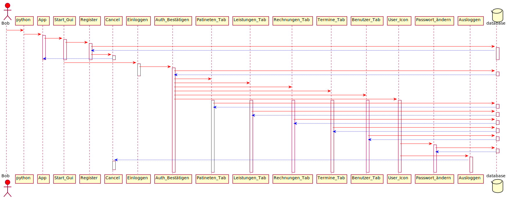

# Patientenverwaltung_WS2021

## Gebrauchte Software

* [x] Debian (Dev Environment)
* [x] Vim (Editor)
* [x] Git (Virsion Control)
* [x] Python3
* [x] tkinter (Pytion GUI module)
* [x] Reportlab (Pytion PDF Gen module)
* [x] sqlite3 (Pytion sqlite module)
* [x] pytweening (Pytion Notification module)

## Führen Sie die Anwendung aus
1- install python >=3

2- `git clone https://mygit.th-deg.de/af21393/patientenverwaltung_ws2021.git` oder download [release](https://mygit.th-deg.de/af21393/patientenverwaltung_ws2021/-/releases)

3- Requirements installieren
#### Auf  Ms Windows  Betriebssystem
innerhalb des Repository-Verzeichnisses:
```
cd  \patientenverwaltung_ws2021
pip3 install -r requirements_win.txt oder
python -m  pip3 install -r requirements_win.txt
```

#### Auf  Linux  Betriebssystem
```
sudo apt install python3-tk
cd patientenverwaltung_ws2021
sudo pip3 install -r requirements.txt
```

3- Application start
```
python3 app.py
```

Hinweis: Standard Datenbank und Rechnungen Verzeichnis `~/Patientenverwaltung/` 
~ ist "Home Directory":
on Windows C:\Users\USERNAME\Patientenverwaltung
on Linux /home/USERNAME/Patientenverwaltung

## Package Diagramm


## Sequence diagram



## Use Case Diagram


## Call Diagram


## Class Diagram


## Patienten verwaltung App Überblick


